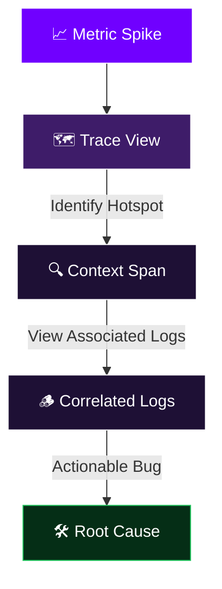
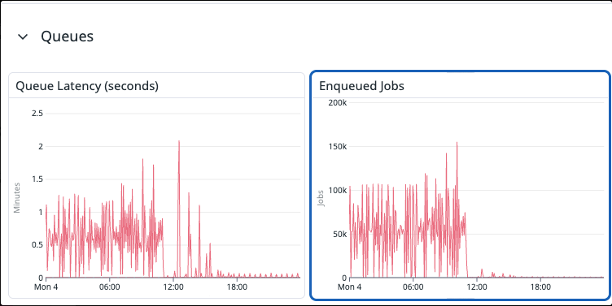
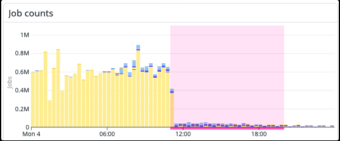
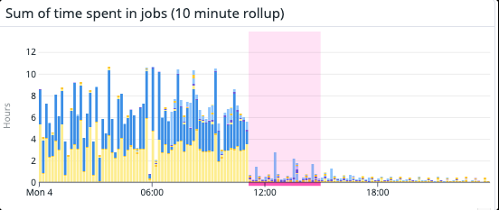
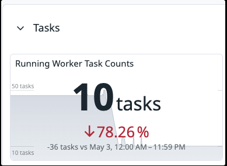
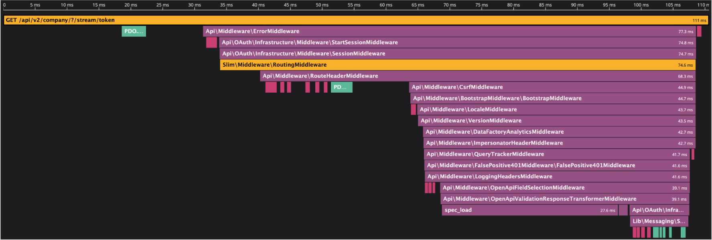
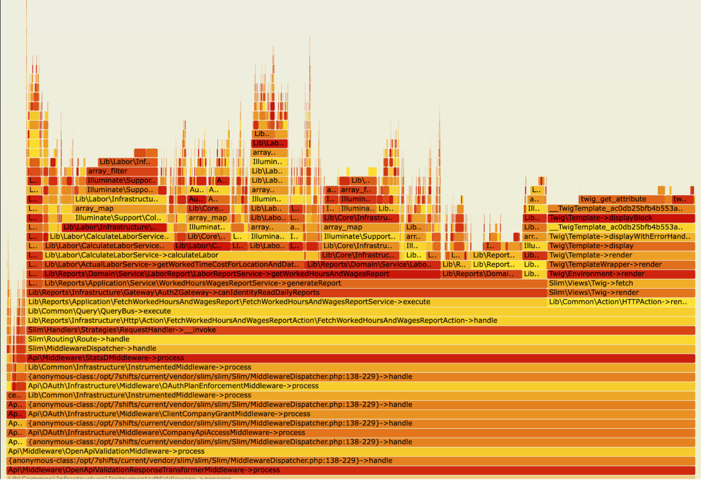

---
# try also 'default' to start simple
theme: default
# apply UnoCSS classes to the current slide for a gorgeous dark background
class: text-center my-auto bg-[#0b0415] overflow-hidden
# some information about your slides (markdown enabled)
title: Observability by Design
info: |
  ## Observability in Practice: logs, metrics, and APM traces with Datadog
  Presentation slides for developers.

  Learn more at [Sli.dev](https://sli.dev)
# https://sli.dev/features/drawing
drawings:
  persist: false
# slide transition: https://sli.dev/guide/animations.html#slide-transitions
transition: slide-left
# enable Comark Syntax: https://comark.dev/syntax/markdown
comark: true
# duration of the presentation
duration: 60min
---

  <!-- Glowing mesh background effects -->
  

  

  <h1 class="text-5xl md:text-6xl font-extrabold tracking-tight mb-2 text-transparent bg-clip-text bg-gradient-to-r from-purple-400 via-indigo-200 to-pink-400 leading-tight">
    Observability by Design
  </h1>
<h2>Seeing through the Noise</h2>

<!--
- Welcome / framing: systems you can reason about, not just systems that run
  - Three pillars: logs, metrics, traces
  - Two real production case studies
  - Concrete habits to take back this week
-->

---
transition: fade-out
---

# Talk Overview

  

    <h3 class="text-purple-400 font-bold mb-2">🎯 Objective</h3>
    
Explain the tooling, and patterns how to write and review code to make systems fundamentally <strong>reason-able</strong>.

  

  <!-- 

    <h3 class="text-purple-400 font-bold mb-2">⏱️ Runtime</h3>
    
60-70 Minutes including Q&A. Grounded in real Datadog usage and two production case studies.

  
 -->

  We'll Cover:
  

    
🪵 <strong class="text-purple-300 block mt-1">Logs</strong>What happened & when

    
📊 <strong class="text-purple-300 block mt-1">Metrics</strong>Behavior over time

    
🗺️ <strong class="text-purple-300 block mt-1">Traces</strong>End-to-end request flow

  

<!--
- Narrow scope: core mental model + daily habits, not every Datadog feature
- Two outcomes for the audience:
  - Look at a PR and ask better observability questions
  - Know which tool to reach for first when something goes wrong
-->

---
transition: slide-up
---

# 01 · Before Observability

Situation: Production is down.

  

    
💬

    Slack Guessing
    
Throwing out theories in incident channels with zero data.

  

  

    
🪵

    Tailing Raw Logs
    
Staring at thousands of unparsed stdout lines scrolling past in a terminal.

  

  

    
🔄

    Hopeful Re-deploying
    
"Let's just restart the service and see if it clears the error state."

  

  

    This is <strong>monitoring</strong> without <strong>observability</strong>. You know the system is sick, but you have no way to ask arbitrary questions about its internal behavior.
  

<!--
- Ask the room: who's been in an incident where the main activity was Slack speculation?
- Key distinction: monitoring vs. observability
  - Monitoring: tells you something is wrong
  - Observability: lets you ask arbitrary questions about *why*
  - "Error rate is up" = monitoring. Filtering to a user, tracing to a query, seeing the exact line = observability
-->

---
layout: center
class: text-center
---

# The Paradigm Shift

  A system that runs is not the same as a system you can reason about.

  Our goal shouldn't be to just to keep the lights on; it should be to build systems where, at 2 AM, an on-call engineer can confidently answer:
  
"Why did this specific user's tip distribution fail?"

<!--
- Goal isn't uptime — uptime is table stakes. Goal is *understanding*
- Black boxes fail in slow, invisible ways
- The example question is deliberately specific
  - Not "why is the error rate high?"
  - "Why did *this user's* tip distribution fail?" — customer + time + business specific
  - That specificity is the bar we're aiming for
-->

---

# 02 · The Three Pillars — A Mental Model

Before touching Datadog, we need a shared understanding of what tools we can use.

  

    
🪵 Logs

    
The Breadcrumbs

    
Discrete events in time. Tell you <strong>what</strong> happened at a specific millisecond, written for debugging.

  

  

    
📊 Metrics

    
The Vital Signs

    
Aggregated numbers over time. Tell you <strong>how healthy</strong> the system is overall (CPU, latencies, rates).

  

  

    
🗺️ Traces

    
The Map

    
Distributed journeys. Follow <strong>a single request</strong> across service boundaries, databases, and queues.

  

<!--
- Three complementary tools, not substitutes
  - Logs: most granular, but don't aggregate well
  - Metrics: great for trends, lose per-request detail
  - Traces: bridge the two — full journey of one request, linked to logs and metrics
- Power is in using all three together — cover each individually, then connect them
-->

---
layout: two-cols
layoutClass: gap-12
---

# The Diagnostics Analogy

When a patient arrives in the ER, a doctor doesn't just guess or start random surgery. They use a structured diagnostic pipeline.

  Unified Diagnostic Workflow:
  
You rarely need all three diagnostic layers at once, but when you are diagnosing a complex pathology, having them all available and <strong>aligned</strong> makes it easy.

::right::

  

    
VITALS

    

      <strong>Metrics</strong>
      
Check heart rate, blood pressure. (Is the system alive and functioning right now?)

    

  

  

    
HISTORY

    

      <strong>Logs</strong>
      
Read the chart, prior symptoms. (What events occurred leading up to this moment?)

    

  

  

    
IMAGING

    

      <strong>Traces</strong>
      
Order an MRI or CT scan. (Where is the exact flow of fluids or signals blocked?)

    

  

<!--
- Doctors don't start surgery because a patient looks pale — they have a protocol
- Same discipline: use tools in order of cost
  - Metrics first: is the error rate elevated?
  - Logs second: what events preceded the failure?
  - Traces last: only if you need the exact execution path
- Each layer is progressively more expensive to generate and store
-->

---
layout: two-cols
layoutClass: gap-12
---

# Unified Observability

The magic of Datadog isn't having three separate tabs. It's being able to **investigate** and **correlate** facts.

  Rapid MTTR:
  

    Moving seamlessly from a metric spike to the exact offending database query trace, and then straight to the error log line.
  

  This correlation loop cuts incident resolution time from <strong>hours</strong> to <strong>minutes</strong>.

::right::

<!--
- MTTR: every extra minute is lost revenue, trust, engineer stress
- Walk the diagram: metric alert → traces in window → span drill-down → correlated logs
- Entire loop can take under 5 minutes
  - But only if trace_id is consistently propagated and logged everywhere
-->

---
layout: two-cols
layoutClass: gap-8
---

# 03 · Logs — Structured is Not Optional

Logs are not for reading. Logs are for **querying**.

  <h3 class="text-red-400 font-bold mb-2">❌ Unstructured (Human-Only)</h3>
  <pre class="font-mono text-[10px] text-red-200">[ERROR] Something went wrong with user 1234</pre>
  <ul class="text-[11px] list-disc pl-4 mt-2 space-y-1 opacity-75">
    <li>Requires regular expressions to extract data</li>
    <li>Impossible to aggregate rates or counts</li>
    <li>No trace correlation linked automatically</li>
  </ul>

::right::

  <h3 class="text-green-400 font-bold mb-2">✅ Structured JSON (Machine-Readable)</h3>
  <pre class="font-mono text-[10px] text-green-200">{
  "level": "error",
  "message": "payment_failed",
  "user_id": "1234",
  "order_id": "abc-789",
  "amount_cents": 4999,
  "error_code": "card_declined",
  "trace_id": "abc123def456",
  "duration_ms": 342
}</pre>
  <ul class="text-[11px] list-disc pl-4 mt-2 space-y-1 opacity-75">
    <li>Datadog indexes every field instantly</li>
    <li>Filter, group, and alert on exact keys</li>
    <li>Queries inform the scope and priority to address</li>
  </ul>

<!--
- Unstructured log is write-only — readable by humans, not queryable by machines
  - Can't group by user_id, can't count error codes, can't alert on rate
- Structured JSON: every key-value pair is filterable and aggregatable
- Point out trace_id specifically — that field is what links the log to the APM trace
  - Without it, logs and traces are two separate islands
- Single most important habit: emit JSON, always
  - parsers exist in the ingest pipelines, but these can be finnicky to configure
-->

---

# Anatomy of a Production-Ready Log

To make logs highly queryable under pressure, ensure these fields are automatically injected:

  

    

      <strong class="text-purple-400 text-sm font-mono block mb-1">trace_id / span_id</strong>
      
The absolute thread. Connects the log line directly to the APM trace waterfall.

    

    

      <strong class="text-purple-400 text-sm font-mono block mb-1">user_id / (tenant)_id</strong>
      
Contextual metadata. Allows filtering logs for a specific customer report.

    

  

  

    

      <strong class="text-purple-400 text-sm font-mono block mb-1">duration_ms</strong>
      
Timing data on handler and job logs. Helps identify slow operations in the log analytics tab.

    

    

      <strong class="text-purple-400 text-sm font-mono block mb-1">error_code</strong>
      
Standardized codes (e.g. `rate_limit_exceeded`) rather than custom string messages.

    

  

<!--
- Four fields = minimum viable log
- trace_id: logging framework should inject this automatically from active span context
- user_id / tenant_id: answers "what happened to this customer?" without DB access
- duration_ms: turns log explorer into a performance profiler — P95 per endpoint without APM
- error_code: standardized codes enable specific alerting
  - `card_declined` has a different business response than `network_timeout`
  - Custom string messages do not aggregate
-->

---

# Log Levels as Signal, Not Noise

If everything is flagged as `ERROR`, nothing is. Use strict heuristics to maintain operational signal:

<table class="w-full text-left border-collapse mt-8 text-sm">
  <thead>
    <tr class="border-b border-gray-700 bg-gray-850/50">
      <th class="p-3 text-purple-400 font-bold w-24">Level</th>
      <th class="p-3 text-purple-400 font-bold">Heuristic / Meaning</th>
      <th class="p-3 text-purple-400 font-bold">Production Behavior</th>
    </tr>
  </thead>
  <tbody>
    <tr class="border-b border-gray-800">
      <td class="p-3">DEBUG</td>
      <td class="p-3">Highly detailed trace information for local development.</td>
      <td class="p-3 opacity-60">Filtered out or omitted in prod.</td>
    </tr>
    <tr class="border-b border-gray-800">
      <td class="p-3">INFO</td>
      <td class="p-3">Normal system events worth recording (e.g. server startup, payment done).</td>
      <td class="p-3 opacity-80">Emitted normally; may be sampled in high-volume services.</td>
    </tr>
    <tr class="border-b border-gray-800">
      <td class="p-3">WARN</td>
      <td class="p-3">Something unexpected, but handled successfully (e.g. database retry).</td>
      <td class="p-3 opacity-85">Emitted. Indicator of systemic decay.</td>
    </tr>
    <tr>
      <td class="p-3">ERROR</td>
      <td class="p-3">Operation failed. A human needs to investigate or be paged.*</td>
      <td class="p-3 font-semibold text-red-400">Triggers alert thresholds and alarms.</td>
    </tr>
    <tr>
      <td class="p-3">CRITICAL</td>
      <td class="p-3">A service is down. A human needs to investigate or be paged.</td>
      <td class="p-3 font-semibold text-red-400">Triggers alert thresholds and alarms.</td>
    </tr>
  </tbody>
</table>

<!--
- Level inflation = alert fatigue — teams learn to ignore a noisy pager
- Strict rule: ERROR means a human must act
- WARN is a leading indicator — a spike in WARN retries tells you a storm is coming
- Code review tip: push back on ERROR logs with a catch block that returns a graceful fallback
  - If you handled it, it's a WARN at most
- note on (*):
  - when starting out, often have error logs which are not errors so there can be exceptions to this, but this is a "North Star" -- something that we should be aiming towards in our work over time
-->

---

# 04 · Metrics — Guided Decision Making

Metrics aggregated over time provide quantitative evidence of system behavior.

  

    
🔢

    <h3 class="text-purple-400 font-bold text-sm mb-1">Counters</h3>
    
Cumulative sums over time. Resets on service restarts.

    
e.g. requests_processed_total

  

  

    
🌡️

    <h3 class="text-purple-400 font-bold text-sm mb-1">Gauges</h3>
    
Point-in-time value. Can fluctuate up and down representing state.

    
e.g. active_connections_gauge

  

  

    
📊

    <h3 class="text-purple-400 font-bold text-sm mb-1">Histograms</h3>
    
Distribution of values. Crucial for measuring percentiles (p95, p99).

    
e.g. request_duration_seconds

  

<!--
- Don't need to memorize all types — know when to reach for each
- Counters: things that only go up (requests, jobs, errors) — useful as rates, not raw values
- Gauges: current state right now — queue depth, active connections, memory
- Histograms: most powerful, most expensive — full distribution, any percentile after the fact
  - Use for anything latency-related so you can query p95/p99 without re-instrumenting
-->

---

# The RED Method

The industry standard framework for measuring service health. Implement this for user-facing service operation.

  

    R
    <h3 class="text-lg font-bold mb-1">Rate</h3>
    
The volume of requests your service is processing per second.

    
sum:requests.rate{*}

  

  

    E
    <h3 class="text-lg font-bold mb-1">Errors</h3>
    
The fraction of requests failing (HTTP 5xx, uncaught exceptions).

    
sum:requests.errors{*}

  

  

    D
    <h3 class="text-lg font-bold mb-1">Duration</h3>
    
Response times distribution. Focus on p95 or p99 latencies, not averages.

    
p95:requests.duration{*}

  

<!--
- Coined by Tom Wilkie at Weaveworks ~2015, de facto standard for request-driven services
- Rate: demand signal — a *drop* in rate is as alarming as a spike (requests not arriving)
- Errors: correctness signal
  - Track both 5xx responses *and* app-level errors that return 200 with an error payload
  - Those are invisible unless explicitly instrumented
- Duration: performance signal — averages lie
  - p99 of 8s can hide behind a p50 of 80ms — always alert on p95 or p99
- Common question: "what about CPU/memory?" → that's the USE method (infra resources)
  - RED is for services; they complement each other
- If your team implemented RED on every endpoint, you'd already be ahead of most teams
-->

---

# Business Metrics vs. Infrastructure

Infrastructure metrics are table stakes. Custom business metrics are what drive product decisions and priority.

  

    <h3 class="text-purple-400 font-bold mb-3">🛠️ Infrastructure Vitals</h3>
    <ul class="space-y-2 list-disc pl-4 opacity-80 text-xs leading-relaxed">
      <li>Is the CPU overloaded or throttled?</li>
      <li>Is memory leaking over time?</li>
      <li>Are thread connection pools exhausted?</li>
    </ul>
    
system.cpu.idle, system.mem.used

  

  

    <h3 class="text-purple-400 font-bold mb-3">💼 Custom Location Health</h3>
    <ul class="space-y-2 list-disc pl-4 opacity-80 text-xs leading-relaxed">
      <li>How many employees do not have AptPay profiles?</li>
      <li>How many integration mappings are out-dated?</li>
      <li>How many tip distributions are never completed?</li>
    </ul>
    
adt.distribution.started, adt.distribution.completed

  

  💡 Agree on team-wide tagging standards (e.g. <code>env:prod</code>, <code>service:adt</code>) early.

<!--
- Infra metrics = the floor — CPU pegged means nothing else matters
- But infra metrics say nothing about business health
  - Silent revenue loss can happen with perfectly healthy infra metrics
  - e.g. payment processor errors being caught and swallowed
- Custom metrics close that gap — track what matters to the business
- Tagging cost warning: every new tag combination = new metric series = higher bill
  - Agree on a taxonomy before shipping custom metrics to prod
-->

---
layout: two-cols
layoutClass: gap-4 grid-cols-[2fr_1fr]
---

# 05 · Case Study: Background Job Queue

Metrics surfaced a system that had quietly grown beyond its design limits.

  

    <h3 class="text-purple-400 font-bold mb-1">🚨 The Alert</h3>
    
A queue-depth metric breached its threshold. The first signal anyone had — the degradation had been invisible until it cascaded.

  

  

    <h3 class="text-purple-400 font-bold mb-1">📊 The Evidence</h3>
    
The system was running <strong>52M jobs/day</strong>, consuming <strong>450 compute-hours/day</strong> across <strong>40 dedicated workers</strong>. Fan-out had outgrown the batch architecture entirely.

  

  

    <h3 class="text-purple-400 font-bold mb-1">💡 The Outcome</h3>
    
Data gave the team confidence to pursue an event-driven rewrite. Result: <strong>52M → 2M jobs</strong>, <strong>450h → 7h compute</strong>, <strong>40 fixed workers → 10 elastic workers</strong>.

  

::right::

  
  
  
  

<!--
- System designed for a much smaller customer base — naive batch, perfectly reasonable at the time
- Usage grew geometrically; fan-out outpaced drain speed → self-reinforcing cascade
- Immediate fix: drain to a holding queue — only possible because we had a metric to confirm recovery
- Making the architectural case:
  - Move to event-driven (state changes, not scheduled scans)
  - Some pushback on unfamiliar patterns
  - The numbers made the argument undeniable — without instrumentation, it would have been guesswork
- After rewrite: 52M→2M jobs, 450h→7h compute, 40 fixed→10 elastic workers
- Key point: this wasn't a 2 AM incident — it was a slow, invisible degradation that metrics caught first
-->

---

# 06 · APM Traces — Following the Request

Logs and metrics tell you *that* something is broken. Traces tell you *where*.

  

    <h3 class="text-red-400 font-bold text-sm mb-2">Without Tracing</h3>
    

      A request fails. You guess which database query is responsible, add manual log statements, rebuild the container, deploy to staging, run a test, and scroll logs.
    

    
🛑 Resolution Time: Hours

  

  

    <h3 class="text-green-400 font-bold text-sm mb-2">With Distributed Tracing</h3>
    

      A request fails. You view the trace waterfall. The system shows that service A waited 5.2s for service B, which was blocked by a single un-indexed N+1 SQL queries on PostgreSQL.
    

    
🚀 Resolution Time: Minutes

  

<!--
- Logs and metrics are retrospective — they tell you *that* and *when*, not *why*
- Tracing is causal: which service called which, in what order, how long each hop took
- Without tracing: hypothesis → instrument → deploy → repro → analyze (repeated)
- With tracing: the whole loop collapses into navigating a UI
-->

---

# Trace Vocab: Spans & Context Propagation

Understanding the engineering mechanics of distributed tracing.

  

    <h3 class="text-purple-400 font-bold text-sm mb-2">1. Trace</h3>
    
The end-to-end journey of a single incoming request. Contains all microservice hops, from gateway to DB.

  

  

    <h3 class="text-purple-400 font-bold text-sm mb-2">2. Span</h3>
    
A single unit of work within a trace. Has a start time, duration, and status (e.g. database query, local function call).

  

  

    <h3 class="text-purple-400 font-bold text-sm mb-2">3. Context Propagation</h3>
    
Injecting and extracting <code>trace_id</code> headers across HTTP, TCP, or queues so downstream systems stay linked.

  

  ⚠️ Frameworks auto-instrument standard calls, but you must define <strong>custom spans</strong> around slow background tasks and complex business logic.

<!--
- Trace = container; spans = building blocks; parent-child relationship creates the waterfall
- Context propagation is where most teams get it wrong
  - When you enqueue a job or fire an async task: serialize trace_id + span_id into the payload
  - Deserialize on the other side — otherwise the job runs as an orphaned trace
- Frameworks auto-instrument HTTP + DB queries
  - Your own async tasks and scheduled jobs need explicit instrumentation
-->

---

# Reading a Waterfall View

How to spot architectural performance bugs from a trace layout.

  

    <h4 class="font-bold text-sm mb-1">📏 Span Width</h4>
    
Width corresponds directly to time. Focus exclusively on the widest horizontal bars; they represent your latency bottleneck.

  

  

    <h4 class="font-bold text-sm mb-1">🕳️ Empty Gaps</h4>
    
Gaps between blocks indicate un-instrumented execution: garbage collection (GC), local CPU-bound computations, or network delays.

  

  

    <h4 class="font-bold text-sm mb-1">🔁 Sequential Spans (N+1)</h4>
    
Dozens of tiny identical spans running in series mean you're executing database query lookups inside a loop. Batch them!

  

<!--
- Waterfall can look overwhelming — focus on three signals only
- Ignore narrow spans — thin = fast = not your problem
- Gaps between parent and child: unaccounted time, un-instrumented work
- N+1 pattern: 50 identical span names stacked vertically
  - `SELECT` inside a `for` loop — classic ORM foot-gun
  - Fixed with a single `includes()` or `prefetch_related()`
-->

---

# 07 · Case Study: Flame Graph Literacy

Before showing the finding, let's make sure we can read a flame graph and spot the hotspot before someone else does.

  

    <h4 class="text-purple-400 font-bold mb-1">🔥 X-Axis isn't Time</h4>
    
The width indicates <strong>stack population percentage</strong> (how often the sampler saw this function active). Wide bars are expensive.

  

  

    <h4 class="text-purple-400 font-bold mb-1">🥞 Y-Axis is Stack Depth</h4>
    
Stack depth, not time. In Datadog's profiler the entry point is at the top, callees grow downward — the inverse of Brendan Gregg's classic layout.

  

  

    <h4 class="text-purple-400 font-bold mb-1">🚨 Wide Near Top</h4>
    
A wide bar at the top of the stack is actively burning CPU cycles. A wide bar in the middle waiting for children is an I/O wait.

  

  

<!--
- Point at the image before moving on
- Entry point is at the top — outermost call, typically the request handler
- Width = fraction of sampled CPU time for that function + everything it called
- Wide near top with no wide children = doing real CPU work → hotspot
- Wide but width comes from one wide child = just the call site, child is the actual cost
-->

---
layout: two-cols
layoutClass: gap-6 grid-cols-[2fr_1fr]
---

# Case Study: Resolving the Hotspot

Timeouts were happening. Metrics said everything else was fine. We generated a trace.

  

    <h3 class="text-purple-400 font-bold mb-1">🚨 The Dead End</h3>
    
Requests were timing out in production. We believed we had already treated the worst offenders — but query metrics showed no slow SQL.

  

  

    <h3 class="text-purple-400 font-bold mb-1">🔍 The Trace</h3>
    
Generating a trace revealed three patterns invisible to metrics: an <strong>automapper running in N² time</strong>, loops allocating memory that was never used, and data fetched but never read.

  

  

    <h3 class="text-purple-400 font-bold mb-1">💡 The Outcome</h3>
    
Treating those three spans cut request time in half. The trace also exposed that report generation needed proper async processes — not just faster inline work.

  

::right::

  

<!--
- Timeouts in prod; already done the obvious tuning pass — no bad SQL in query metrics
- Felt out of ideas → decided to generate a trace
- Three patterns the trace made immediately visible (metrics couldn't):
  - Automapper called in a loop — O(n²), scaled catastrophically with payload size
  - Loops allocating arrays/objects nothing ever consumed — wide spans, no children
  - External calls fetching data the response never used — pure waste under load
- None showed up in SQL metrics because none were slow SQL — application-layer inefficiencies
- Result: treating those three spans cut request time in half
- Bonus insight: report generation can't be micro-optimized — needs a proper async process
  - The trace gave us evidence to make that architectural argument
-->

---

# 08 · Designing for Observability — The Hard Shift

Observability is not a feature you bolt on after the code is written. It is a core design constraint.

  
The 2 AM On-Call Heuristic

  

    "If this code breaks in production at 2am, can I confidently diagnose the root cause from Datadog dashboards and logs alone, without SSHing into a server or running a local test?"
  

  

    "Can I diagnose the root cause without jupyter access?"
  

  If the answer is no, your PR is not ready to ship.

<!--
- Separates teams with good observability from teams who just have Datadog installed
- Can't be added retroactively without significant rework — design constraint, same as security
- The heuristic is a forcing function: before opening a PR, simulate being on-call
  - Can you find the failure?
  - Can you find the specific user affected?
  - Can you tell if it's a one-off or systemic?
- If you can't answer from Datadog alone, the code isn't done yet
-->

---

# Practical Code-Level Habits

Transition these principles into daily coding practices:

  

    

      <strong class="text-green-300 block mb-1">🪵 Meaningful State Changes</strong>
      
Log events when states transition. <code>payment.initiated</code>, <code>payment.succeeded</code>. Avoid logging loop indices.

    

    

      <strong class="text-green-300 block mb-1">🧹 Exception Hygiene</strong>
      
Never write empty <code>catch</code> blocks. Log the stack trace and relevant entity context.

    

  

  

    

      <strong class="text-green-300 block mb-1">🚀 Context Over Loops</strong>
      
Inject correlation headers before spawning async microservice threads or background queues.

    

    

      <strong class="text-green-300 block mb-1">🏷️ Consistent Tagging</strong>
      
Always attach low-cardinality key-value pairs (<code>env:prod</code>, <code>region:us-east</code>) to traces and custom events.

      
⚠️ New tags = new metric series = higher bill. Review with the team before adding.

    

  

<!--
- All four habits are near-zero cost once muscle memory
- State changes: test — "would an on-call engineer understand this line with no other context?"
- Exception hygiene: empty catch is one of the most dangerous prod patterns
  - Silently swallows failures, system looks healthy while broken
- Context propagation: trace_id goes in the task payload at spawn time, not reconstructed later
- Tagging: before adding a new tag, ask if an existing tag achieves the same filtering
  - Cardinality is money in Datadog
-->

---

# Observability-Driven Code Reviews

Make observability a mandatory review milestone. Ask these questions in every Pull Request:

  

    

      1.
      
"Does this new code path emit sufficient logging to identify when it fails?"

    

    

      2.
      
"Are we capturing trace context through this new async Celery task?"

    

  

  

    

      3.
      
"Are the new metrics named consistently with our team naming registry?"

    

    

      4.
      
"Will this swallowed database exception black hole our alerts?"

    

  

  This shifts observability from a platform-team bottleneck to a <strong>shared engineering discipline</strong>.

---

# 09 · Putting It Together in Datadog

How a unified observability platform streamlines real-world debugging:

  

    
Step 1

    <strong>Metric Spikes</strong>
    
Alert triggers: 5xx rate jumps to 4%.

  

  
  
➔

  

    
Step 2

    <strong>Filter Traces</strong>
    
Isolate traces degrading in that specific window.

  

  
  
➔

  

    
Step 3

    <strong>Locate Span</strong>
    
Trace waterfall points directly to a slow DB span.

  

  
➔

  

    
Step 4

    <strong>Inspect Logs</strong>
    
Correlated logs show the exact syntax exception.

  

  This seamless pivot is only possible if your services consistently propagate and log their <strong>trace_id</strong>.

---

# 10 · Close: Where to Start

Abstract advice changes nothing. Try these three concrete tasks starting Monday morning:

  

    
🪵

    <h3 class="text-purple-400 font-bold text-sm mb-1">1. In Your Next PR</h3>
    
Ask: Should this code path emit any <strong>logs</strong> or <strong>metrics</strong>?

  

  

    
📊

    <h3 class="text-purple-400 font-bold text-sm mb-1">2. In Your Next Endpoint</h3>
    
Find out how to find the three <strong>RED Method metrics</strong> (Rate, Errors, Duration) in Datadog after it ships.

  

  

    
🗺️

    <h3 class="text-purple-400 font-bold text-sm mb-1">3. In Your Next Bugfix</h3>
    
Ask: What can I do to make this problem <strong>observable</strong> next time?

  

  📈 Observability compounds. Small, incremental additions save massive incident hours later.

---
layout: center
class: text-center
---

# Q&A & Open Discussion

  What observability blind spots or incidents have caught you off-guard?

