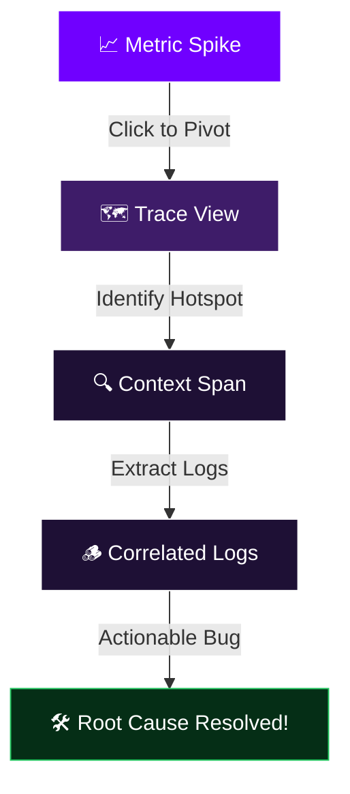
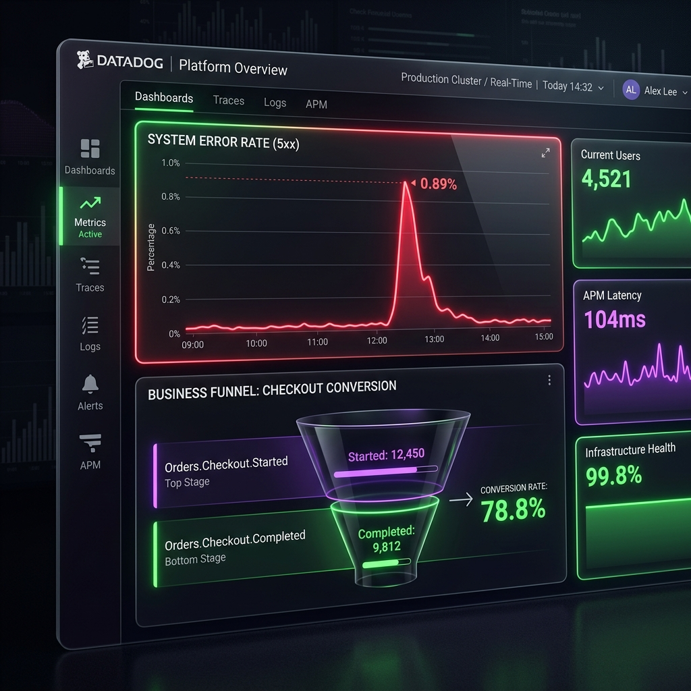
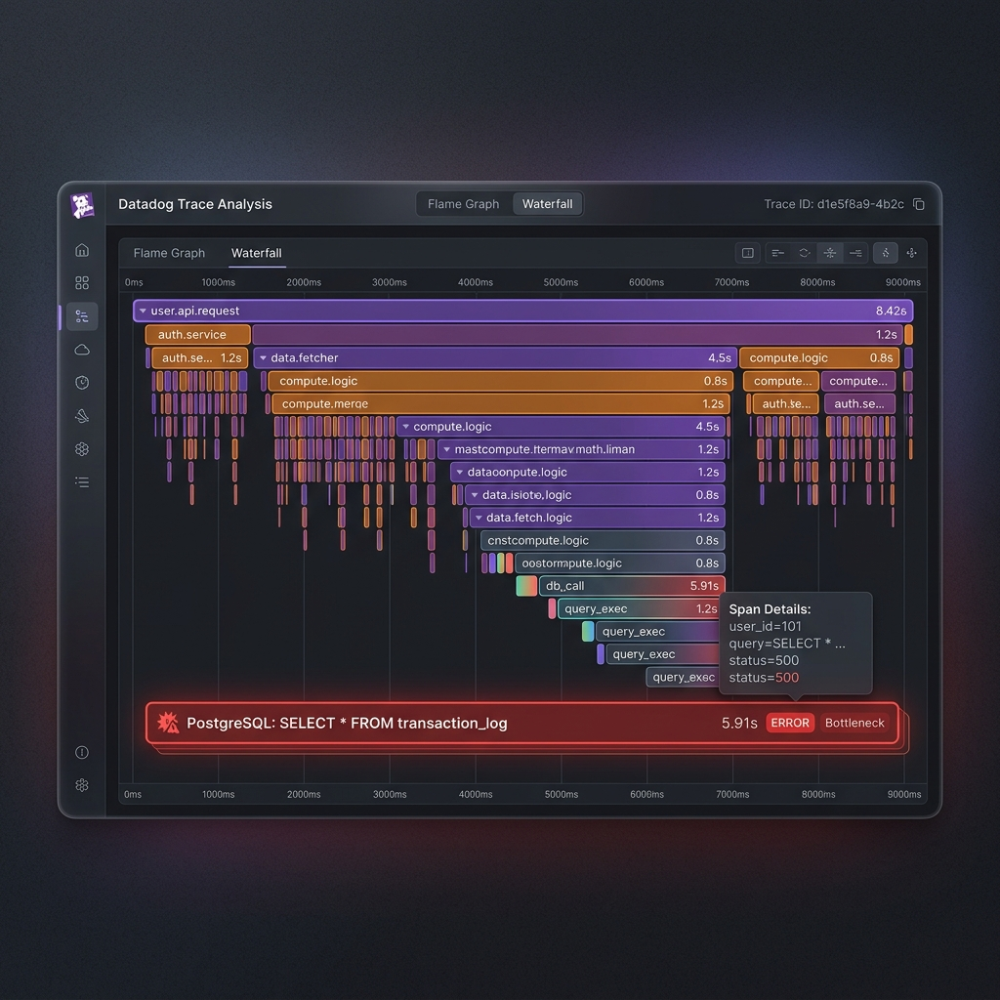

---
# try also 'default' to start simple
theme: default
background: https://images.unsplash.com/photo-1618005182384-a83a8bd57fbe?q=80&w=2564&auto=format&fit=crop
# some information about your slides (markdown enabled)
title: Observability in Practice
info: |
  ## Observability in Practice: logs, metrics, and APM traces with Datadog
  Presentation slides for developers.

  Learn more at [Sli.dev](https://sli.dev)
# apply UnoCSS classes to the current slide
class: text-center my-auto
# https://sli.dev/features/drawing
drawings:
  persist: false
# slide transition: https://sli.dev/guide/animations.html#slide-transitions
transition: slide-left
# enable Comark Syntax: https://comark.dev/syntax/markdown
comark: true
# duration of the presentation
duration: 60min
---

# Observability in Practice
### Logs, Metrics, and APM Traces with Datadog

  A Dev Talk for Mid-Senior Engineers

  Datadog Observability Series • 60-70 min

<!--
The last comment block of each slide will be treated as slide notes. It will be visible and editable in Presenter Mode along with the slide.
-->

---
transition: fade-out
---

# Talk Overview

A production-grounded session designed to shift how you reason about your codebase.

  

    <h3 class="text-purple-400 font-bold mb-2">🎯 Objective</h3>
    
Not just explaining the tooling, but changing how you write and review code to make systems fundamentally <strong>reason-able</strong>.

  

  

    <h3 class="text-purple-400 font-bold mb-2">⏱️ Runtime</h3>
    
60-70 Minutes including Q&A. Grounded in real Datadog usage and two production case studies.

  

  The Core Pillars We'll Cover:
  

    
🪵 <strong class="text-purple-300 block mt-1">Logs</strong>What happened & when

    
📊 <strong class="text-purple-300 block mt-1">Metrics</strong>Behavior over time

    
🗺️ <strong class="text-purple-300 block mt-1">Traces</strong>End-to-end request flow

  

---
transition: slide-up
---

# 01 · The Pain Before Observability

A familiar scene: Production is down.

  

    
💬

    Slack Guessing
    
Engineers throwing out wild theories in incident channels with zero data.

  

  

    
🪵

    Tailing Raw Logs
    
Staring at thousands of unparsed stdout lines scrolling past in a terminal.

  

  

    
🔄

    Hopeful Re-deploying
    
"Let's just bounce the service and see if it clears the error state."

  

  

    "This is the world of <strong>monitoring</strong> without <strong>observability</strong>. You know the system is sick, but you have no way to ask arbitrary questions about its internal behavior."
  

---
layout: center
class: text-center
---

# The Paradigm Shift

  A system that runs is not the same as a system you can reason about.

  Our goal isn't just to keep the lights on; it's to build systems where, at 2 AM, an on-call engineer can confidently answer:
  
"Exactly why did this specific user's checkout fail?"

---

# 02 · The Three Pillars — A Mental Model

Before touching Datadog, we need a shared understanding of what these tools actually do.

  

    
🪵 Logs

    
The Breadcrumbs

    
Discrete events in time. Tell you <strong>what</strong> happened at a specific millisecond, written for debugging.

  

  

    
📊 Metrics

    
The Vital Signs

    
Aggregated numbers over time. Tell you <strong>how healthy</strong> the system is overall (CPU, latencies, rates).

  

  

    
🗺️ Traces

    
The Map

    
Distributed journeys. Follow <strong>a single request</strong> across service boundaries, databases, and queues.

  

---
layout: two-cols
layoutClass: gap-12
---

# The Diagnostics Analogy

When a patient arrives in the ER, a doctor doesn't just guess or start random surgery. They use a structured diagnostic pipeline.

  Unified Diagnostic Workflow:
  
You rarely need all three diagnostic layers at once, but when you are diagnosing a complex pathology, they must all be available and <strong>perfectly aligned</strong>.

::right::

  

    
VITALS

    

      <strong>Metrics</strong>
      
Check heart rate, blood pressure. (Is the system alive and functioning right now?)

    

  

  

    
HISTORY

    

      <strong>Logs</strong>
      
Read the chart, prior symptoms. (What events occurred leading up to this moment?)

    

  

  

    
IMAGING

    

      <strong>Traces</strong>
      
Order an MRI or CT scan. (Where is the exact flow of fluids or signals blocked?)

    

  

---
layout: two-cols
layoutClass: gap-12
---

# Unified Observability

The magic of Datadog isn't having three separate tabs. It's the **instant correlation pivot** between them.

  Rapid MTTR:
  

    Moving seamlessly from a metric spike to the exact offending database query trace, and then straight to the error log line.
  

  This correlation loop cuts incident resolution time from <strong>hours</strong> to <strong>seconds</strong>.

::right::

---
layout: two-cols
layoutClass: gap-8
---

# 03 · Logs — Structured is Not Optional

Logs are not for reading. Logs are for **querying**.

  <h3 class="text-red-400 font-bold mb-2">❌ Unstructured (Human-Only)</h3>
  <pre class="font-mono text-[10px] text-red-200">[ERROR] Something went wrong with user 1234</pre>
  <ul class="text-[11px] list-disc pl-4 mt-2 space-y-1 opacity-75">
    <li>Requires regular expressions to extract data</li>
    <li>Impossible to aggregate rates or counts</li>
    <li>No trace correlation linked automatically</li>
  </ul>

::right::

  <h3 class="text-green-400 font-bold mb-2">✅ Structured JSON (Machine-Readable)</h3>
  <pre class="font-mono text-[10px] text-green-200">{
  "level": "error",
  "message": "payment_failed",
  "user_id": "1234",
  "order_id": "abc-789",
  "amount_cents": 4999,
  "error_code": "card_declined",
  "trace_id": "abc123def456",
  "duration_ms": 342
}</pre>
  <ul class="text-[11px] list-disc pl-4 mt-2 space-y-1 opacity-75">
    <li>Datadog indexes every field instantly</li>
    <li>Filter, group, and alert on exact keys</li>
  </ul>

---

# Anatomy of a Production-Ready Log

To make logs highly queryable under pressure, ensure these fields are automatically injected:

  

    

      <strong class="text-purple-400 text-sm font-mono block mb-1">trace_id / span_id</strong>
      
The absolute thread. Connects the log line directly to the APM trace waterfall.

    

    

      <strong class="text-purple-400 text-sm font-mono block mb-1">user_id / tenant_id</strong>
      
Contextual metadata. Allows filtering logs for a specific customer report.

    

  

  

    

      <strong class="text-purple-400 text-sm font-mono block mb-1">duration_ms</strong>
      
Timing data. Helps filter out slow operations in the log analytics tab.

    

    

      <strong class="text-purple-400 text-sm font-mono block mb-1">error_code</strong>
      
Standardized codes (e.g. `rate_limit_exceeded`) rather than messy custom string messages.

    

  

---

# Log Levels as Signal, Not Noise

If everything is flagged as `ERROR`, nothing is. Use strict heuristics to maintain operational signal:

<table class="w-full text-left border-collapse mt-8 text-sm">
  <thead>
    <tr class="border-b border-gray-700 bg-gray-850/50">
      <th class="p-3 text-purple-400 font-bold w-24">Level</th>
      <th class="p-3 text-purple-400 font-bold">Heuristic / Meaning</th>
      <th class="p-3 text-purple-400 font-bold">Production Behavior</th>
    </tr>
  </thead>
  <tbody>
    <tr class="border-b border-gray-800">
      <td class="p-3">DEBUG</td>
      <td class="p-3">Highly detailed trace information for local development.</td>
      <td class="p-3 opacity-60">Filtered out or omitted in prod.</td>
    </tr>
    <tr class="border-b border-gray-800">
      <td class="p-3">INFO</td>
      <td class="p-3">Normal system events worth recording (e.g. server startup, payment done).</td>
      <td class="p-3 opacity-80">Emitted normally, highly throttled.</td>
    </tr>
    <tr class="border-b border-gray-800">
      <td class="p-3">WARN</td>
      <td class="p-3">Something unexpected, but handled successfully (e.g. database retry).</td>
      <td class="p-3 opacity-85">Emitted. Indicator of systemic decay.</td>
    </tr>
    <tr>
      <td class="p-3">ERROR</td>
      <td class="p-3">Operation failed. A human needs to investigate or be paged.</td>
      <td class="p-3 font-semibold text-red-400">Triggers alert thresholds and alarms.</td>
    </tr>
  </tbody>
</table>

---

# 04 · Metrics — Guided Decision Making

Metrics aggregated over time provide quantitative evidence of system behavior.

  

    
🔢

    <h3 class="text-purple-400 font-bold text-sm mb-1">Counters</h3>
    
Cumulative sums over time. Resets on service restarts.

    
e.g. requests_processed_total

  

  

    
🌡️

    <h3 class="text-purple-400 font-bold text-sm mb-1">Gauges</h3>
    
Point-in-time value. Can fluctuate up and down representing state.

    
e.g. active_connections_gauge

  

  

    
📊

    <h3 class="text-purple-400 font-bold text-sm mb-1">Histograms</h3>
    
Distribution of values. Crucial for measuring percentiles (p95, p99).

    
e.g. request_duration_seconds

  

---

# The RED Method

The industry standard framework for measuring service health. Implement this for every endpoint.

  

    R
    <h3 class="text-lg font-bold mb-1">Rate</h3>
    
The volume of requests your service is processing per second.

    
sum:requests.rate{*}

  

  

    E
    <h3 class="text-lg font-bold mb-1">Errors</h3>
    
The fraction of requests failing (HTTP 5xx, uncaught exceptions).

    
sum:requests.errors{*}

  

  

    D
    <h3 class="text-lg font-bold mb-1">Duration</h3>
    
Response times distribution. Focus exclusively on p95 or p99 latencies.

    
p95:requests.latency{*}

  

---

# Business Metrics vs. Infrastructure

Infrastructure metrics are table stakes. Custom business metrics are what drive product decisions and priority.

  

    <h3 class="text-purple-400 font-bold mb-3">🛠️ Infrastructure Vitals</h3>
    <ul class="space-y-2 list-disc pl-4 opacity-80 text-xs leading-relaxed">
      <li>Is the CPU overloaded or throttled?</li>
      <li>Is memory leaking over time?</li>
      <li>Are thread connection pools exhausted?</li>
    </ul>
    
system.cpu.idle, system.mem.used

  

  

    <h3 class="text-purple-400 font-bold mb-3">💼 Custom Conversion Funnel</h3>
    <ul class="space-y-2 list-disc pl-4 opacity-80 text-xs leading-relaxed">
      <li>How many checkout funnels were started?</li>
      <li>What is the payment success percentage?</li>
      <li>Where are users dropping off?</li>
    </ul>
    
orders.checkout.started, orders.checkout.completed

  

  💡 Crucial rule: Agree on team-wide tagging standards (e.g. <code>env:prod</code>, <code>service:checkout</code>) from day one.

---
layout: two-cols
layoutClass: gap-12
---

# 05 · Case Study: Conversion Funnel

Using structured custom metrics to diagnose business-level degradation.

  

    <h3 class="text-purple-400 font-bold mb-1">🔍 The Discovery</h3>
    
A Datadog dashboard monitored checkout. We spotted a massive delta between <code>orders.checkout.started</code> and <code>completed</code>.

  

  

    <h3 class="text-purple-400 font-bold mb-1">📊 The Evidence</h3>
    
A <strong>78.8% conversion rate</strong> was observed, but the <strong>5xx error rate spiked to 0.89%</strong> during peak traffic, triggering page alarms.

  

  

    <h3 class="text-purple-400 font-bold mb-1">💡 The Outcome</h3>
    
Turned "I think payment is slow" into "I know payment fails for 1.1% of checkouts." We got the roadmap allocation to resolve it.

  

::right::

  

---

# 06 · APM Traces — Following the Request

Logs and metrics tell you *that* something is broken. Traces tell you *where*.

  

    <h3 class="text-red-400 font-bold text-sm mb-2">Without Tracing</h3>
    

      A request fails. You guess which database query is responsible, add manual log statements, rebuild the container, deploy to staging, run a test, and scroll logs.
    

    
🛑 Resolution Time: Hours

  

  

    <h3 class="text-green-400 font-bold text-sm mb-2">With Distributed Tracing</h3>
    

      A request fails. You view the trace waterfall. The system shows that service A waited 5.2s for service B, which was blocked by a single un-indexed SQL query on PostgreSQL.
    

    
🚀 Resolution Time: Seconds

  

---

# Trace Vocab: Spans & Context Propagation

Understanding the engineering mechanics of distributed tracing.

  

    <h3 class="text-purple-400 font-bold text-sm mb-2">1. Trace</h3>
    
The end-to-end journey of a single incoming request. Contains all microservice hops, from gateway to DB.

  

  

    <h3 class="text-purple-400 font-bold text-sm mb-2">2. Span</h3>
    
A single unit of work within a trace. Has a start time, duration, and status (e.g. database query, local function call).

  

  

    <h3 class="text-purple-400 font-bold text-sm mb-2">3. Context Propagation</h3>
    
Injecting and extracting <code>trace_id</code> headers across HTTP, TCP, or queues so downstream systems stay linked.

  

  ⚠️ Frameworks auto-instrument standard calls, but you must define <strong>custom spans</strong> around slow background tasks and complex business logic.

---

# Reading a Waterfall View

How to spot architectural performance bugs from a trace layout.

  

    <h4 class="font-bold text-sm mb-1">📏 Span Width</h4>
    
Width corresponds directly to time. Focus exclusively on the widest horizontal bars; they represent your latency bottleneck.

  

  

    <h4 class="font-bold text-sm mb-1">🕳️ Empty Gaps</h4>
    
Gaps between blocks indicate un-instrumented execution: garbage collection (GC), local CPU-bound computations, or network delays.

  

  

    <h4 class="font-bold text-sm mb-1">🔁 Sequential Spans (N+1)</h4>
    
Dozens of tiny identical spans running in series mean you're executing database query lookups inside a loop. Batch them!

  

---

# 07 · Case Study: Flame Graph Literacy

Before showing the finding, let's learn how to read a flame graph without looking lost in group meetings.

  

    <h4 class="text-purple-400 font-bold mb-1">🔥 X-Axis isn't Time</h4>
    
The width indicates <strong>stack population percentage</strong> (how often the sampler saw this function active). Wide bars are expensive.

  

  

    <h4 class="text-purple-400 font-bold mb-1">🥞 Y-Axis is Stack Depth</h4>
    
The bottom is the entry point (e.g. main handler), moving up to leaf-level execution code blocks.

  

  

    <h4 class="text-purple-400 font-bold mb-1">🚨 Wide Near Top</h4>
    
A wide bar at the top of the stack is actively burning CPU cycles. A wide bar in the middle waiting for children is an I/O wait.

  

---
layout: two-cols
layoutClass: gap-12
---

# Case Study: Resolving the Hotspot

An unexpected database bottleneck is diagnosed under operational stress.

  

    <h3 class="text-purple-400 font-bold mb-1">📉 The Incident</h3>
    
Our main API endpoint was timing out intermittently. Logs were flooded but showed no obvious trace.

  

  

    <h3 class="text-purple-400 font-bold mb-1">🔍 The Trace</h3>
    
The trace graph immediately isolated a <code>db_call</code> blocking for <strong>5.91 seconds</strong>. It was a <code>SELECT * FROM transaction_log</code> operation lacking an index.

  

  

    <h3 class="text-purple-400 font-bold mb-1">🛠️ The Fix</h3>
    
Added a composite index, reduced the span duration to 15ms, and instantly dropped p99 API latencies to double-digits.

  

::right::

  

---

# 08 · Designing for Observability — The Hard Shift

Observability is not a feature you bolt on after the code is written. It is a core design constraint.

  
The 2 AM On-Call Heuristic

  

    "If this code breaks in production at 2am, can I confidently diagnose the root cause from Datadog dashboards and logs alone, without SSHing into a server or running a local test?"
  

  If the answer is **no**, your PR is not ready to ship.

---

# Practical Code-Level Habits

Transition these principles into daily coding practices:

  

    

      <strong class="text-green-300 block mb-1">🪵 Meaningful State Changes</strong>
      
Log events when states transition. <code>payment.initiated</code>, <code>payment.succeeded</code>. Avoid logging loop indices.

    

    

      <strong class="text-green-300 block mb-1">🧹 Exception Hygiene</strong>
      
Never write empty <code>catch</code> blocks. Log the stack trace and relevant entity context.

    

  

  

    

      <strong class="text-green-300 block mb-1">🚀 Context Over Loops</strong>
      
Inject correlation headers before spawning async microservice threads or background queues.

    

    

      <strong class="text-green-300 block mb-1">🏷️ Consistent Tagging</strong>
      
Always attach key-value pairs (<code>env:prod</code>, <code>region:us-east</code>) to traces and custom events.

    

  

---

# Observability-Driven Code Reviews

Make observability a mandatory review milestone. Ask these questions in every Pull Request:

  

    

      1.
      
"Does this new code path emit sufficient logging to identify when it fails?"

    

    

      2.
      
"Are we capturing trace context through this new async rabbitMQ queue worker?"

    

  

  

    

      3.
      
"Are the new metrics named consistently with our team naming registry?"

    

    

      4.
      
"Will this swallowed database exception black hole our alerts?"

    

  

  This shifts observability from a platform-team bottleneck to a **shared engineering discipline**.

---

# 09 · Putting It Together in Datadog

How a unified observability platform streamlines real-world debugging:

  

    
Step 1

    <strong>Metric Spikes</strong>
    
Alert triggers: 5xx rate jumps to 4%.

  

  
  
➔

  

    
Step 2

    <strong>Filter Traces</strong>
    
Isolate traces degrading in that specific window.

  

  
  
➔

  

    
Step 3

    <strong>Locate Span</strong>
    
Trace waterfall points directly to a slow DB span.

  

  
➔

  

    
Step 4

    <strong>Inspect Logs</strong>
    
Correlated logs show the exact syntax exception.

  

  This seamless pivot is only possible if your services consistently propagate and log their <strong>trace_id</strong>.

---

# 10 · Close: Where to Start on Monday

Abstract advice changes nothing. Try these three concrete tasks starting Monday morning:

  

    
🪵

    <h3 class="text-purple-400 font-bold text-sm mb-1">1. In Your Next PR</h3>
    
Add just <strong>one</strong> structured field (e.g. <code>user_id</code> or <code>duration_ms</code>) to an existing raw string log.

  

  

    
📊

    <h3 class="text-purple-400 font-bold text-sm mb-1">2. In Your Next Endpoint</h3>
    
Implement the three <strong>RED Method metrics</strong> (Rate, Errors, Duration) using Datadog client libraries.

  

  

    
🗺️

    <h3 class="text-purple-400 font-bold text-sm mb-1">3. In Your Next Bugfix</h3>
    
Wrap the suspected bottleneck method in a <strong>custom tracer span</strong> to visualize it on the flame graph.

  

  📈 Observability compounds. Small, incremental additions save massive incident hours later.

---
layout: center
class: text-center
---

# Q&A & Open Discussion

  What observability blind spots or incidents have caught you off-guard?

  
Datadog Observability Series

  
Presented as an Internal Dev Talk

